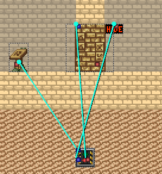
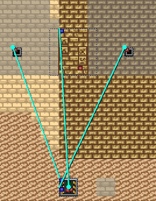
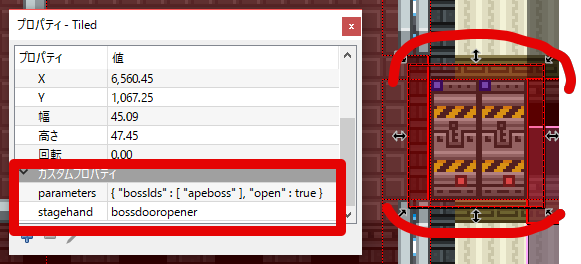
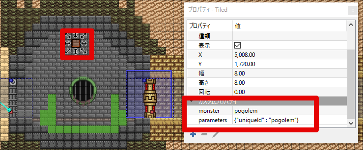
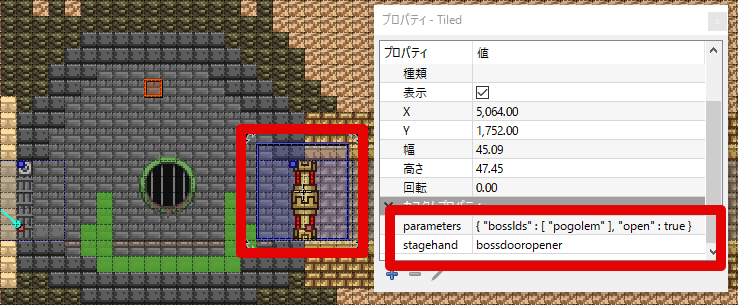
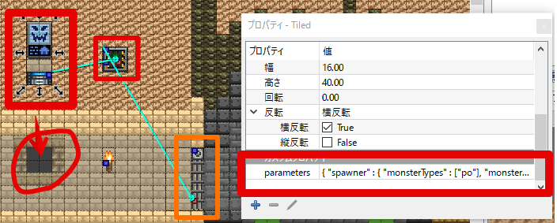

# Docuemnts for javabound developers

Note: `__unpacked` means [unpacked assets].

## List of objects

Icon                    | Images                |Internal name       |    Description             | Label       | Description(ja) | Label(ja)
------------------------|-----------------------|--------------------|----------------------------|-------------|-------------|----------
![javasta.i]            |![javasta]             |java-crafting-station | Java Factory             | -           | ジャバ工場    | -
![javabo.i]             |![javabo]             |javabo              | Crimson Javabutton         | "Free Java Download" | 紅いジャバボタン | "無料ジャバのダウンロード"
![javabo-couch.i]       |![javabo-couch]       |javabo-couch        | Loungeable Crimson Javabutton | "Free Java Download" | 座れる、紅いジャバボタン | "無料ジャバのダウンロード"
![javabo-blue.i]        |![javabo-blue]        |javabo-blue         | Navy Javabutton            | TODO: ???? | 青いジャバボタン| "無料ジャバのダ"
![javabo-couch-blue.i]  |![javabo-couch-blue]  |javabo-couch-blue   | Loungeable Navy Javabutton | TODO: ???? | 座れる、青いジャバボタン| "無料ジャバのダ"
![javabo-block.i]       |![javabo-block]       |javabo-block        | Stackable ornament. <br>(The prototype of `Java Button`) |  "J"  | スタックできるブロックのような置物。 <br>(MOD作成中の産物なので実はオマケ) | "ジ"
![javacopy-java-you.i]  |![javacopy-java-you]  |javacopy-java-you   | Message A from Java        | "JAVA+YOU"  | ジャバからのメッセージ A | "あなたとジャバ,"
![javacopy-downloa.i]   |![javacopy-downloa]   |javacopy-downloa    | Message B from Java        | "DOWNLOAD" | ジャバからのメッセージ B | "今すぐダウンロー" |
![javacopy-do.i]        |![javacopy-do]        |javacopy-do         | Message C from Java        | "TODAY!"  | メッセージC。 メッセージBの最後が改行される環境を再現するため、独立して用意した。 <br> 英語版は、三行目が "TODAY!" となり自然なため、問題ない。 | "ド"


### Ref. (lang:en)

[](https://gyazo.com/316b51f871313de57be3b34f8318afa4)

### Ref. (lang:ja)


## Rules of filenames

### Example:

```text
          [FIXED] Project name
             /
            |                Sub object name     for icon. Ex. {|.icon}
            |________           /___________     /____
 src/objects/javabound/javacopy-downloa-today_ja.icon.png
    ~~~~~~~           ~~~~~~~~               ~~
    /                /                      /
    |                |                     language 
    |                Main object name         Ex. {_js|_en|...}
    |
    One of structure for Starbound.
        Ex. {recipes|items|tiles|...}
```

### Extensions:

* **\*.[frames]** : JSON. The definitions of sprite.
    
    if `foo.png` exists, then need `foo.frames`.

* **\*.object**  : JSON. Metadata. ( Description, Name, category... )
* **\*.png** : Object iamge.
* **\*.icon.png**  : Icon for `Crafting Table` or `Inventory` or when it's on floorthe .
* **\*.recipe** : JSON. Meta data for crafting. (Ex.  0 money per 1 Java button )
* **\*.patch** : JSON. patch for existing JSON. See [RFC 6901].


Note: A rule of **\*.icon.png** is own's one.

## Localization

TODO: Add Rules.

Idea 1

> javabo_**ja**.object -> javabo_**en**.object

## About *.frames

* "orientations"
  * "image" : 向きに関わらず、左右反転させないときの画像ファイル指定。(文字があるときに有効)
  * "dualImage" : 向きに応じて、左右反転させる。 (文字が鏡文字になる？)
  * "imageLayers" : レイヤーを多層にするとき。

.animation があるとき、 "image" 指定に関わらず片方が鏡文字になる場合は、
以下のように "direction" を指定するとよいかもしれない。

```JSON
  "orientations" : [
    {
      (略)
      "direction" : "right",
```

### imageLayers の例:

`"fullbright" : true` を付加すると、ライティングを無視(?)して表示できる。

下記の例では、 `java-crafting-station.png` を(ライトを無視して)はっきり表示し、
その上に override する形で `java-crafting-station.lit.png` を表示している。

一部を目立たせるオブジェクトに使うとよさそうである。

```JSON
      "imageLayers" : [
        { "image" : "java-crafting-station.png:<color>.<frame>", "fullbright" : true }, 
        { "image" : "java-crafting-station.lit.png:<color>.<frame>" } 
      ],
```

実際の例: `vendingmachine`

## About interactions

### Momentary switch (押しボタン)

at `*.object`

```JSON
  "animation" : "/objects/wired/switch/switchtoggle.animation",
  "scripts" : [
    "/objects/wired/momentaryswitch/momentaryswitch.lua",
  ],

  // scriptDelta / 60 * interval 秒間つく
  "scriptDelta" : 5,    // lua内のupdateイベント実行間隔 (tick数)
  "interval" : 15,      // offになるまでのカウント(updateイベントが指定回実行されるとオフになる)

  "outputNodes" : [ [0, 0] ],   // 出力穴を1個 (0,0) の位置に配置
```

他の .animation と被る場合は、.animation を書き起こす必要があるかも。

Ref:

* `__unpacked/objects/wired/momentaryswitch/momentaryswitch.lua`

Examples:

* `__unpacked/objects/wired/tinywallbutton/tinywallbutton.object`
* `__unpacked/objects/wired/smallwallbutton/smallwallbutton.object`


### Switch (切り替えスイッチ)

Persistentswitch は memorize な switch?

Ref:

* `__unpacked/objects/wired/switch/persistentswitch.lua`
* `__unpacked/objects/wired/switch/switch.lua`

Examples:

* `__unpacked/objects/wired/persistentswitch/persistentswitch.object`
* `__unpacked/objects/wired/tinywallswitch/tinywallswitch.object`
* `__unpacked/objects/wired/smallwallswitch/smallwallswitch.object`

### wiring 組合せ memo

* `Small Wall Button` + `Alert Light` : oneshot(momentary) alert.
  * `Small Wall Button` :
  * `Alert Light` :
* `Small Wall Switch` + `Alert Light` : ON/OFF switch for alert


## Making crafting

ref. `__unpacked/objects/crafting/*`

ref. Existing crafting objects(ver 1.1): 

Icon               | Image            |objectName          |Size  | frames
-------------------|------------------|--------------------|------|--------
![obj-campfire.i]  |![obj-campfire]   |campfire            |16x16 | 4
![obj-wooden.i]    |![obj-wooden]     |woodencookingtable  |32x36 | 1
![obj-furnace1.i]  |![obj-furnace1]   |craftingfurnace     |24x24 | 4
![obj-furnace2.i]  |![obj-furnace2]   |craftingfurnace     |24x24 | 4
![obj-pixelc.i]    |![obj-pixelc]     |pixelcompressor     |48x32 | 8

### Directory

* `/interface/javabound/*.png`: Parts of UI.

### `*.object` template

interactData:

```JSON
  // (略)
  "interactAction" : "OpenCraftingInterface",
  "interactData" : {
    // Search "crafting.*\.config" ...
    // Ex. crafting.config
    // Ex. craftingmerchant.config
    "config" : "/interface/windowconfig/crafting*****.config",
    
    // Crafting category
    // Ex. "campfire",
    "filter" : [ "*****" ],

    // Override interface
    "paneLayoutOverride" : {
      "windowtitle" : {
        "title" : " *******************",
        "subtitle" : " ***********************************",
        "icon" : {
          "file" : "/interface/javabound/****icon.png"
        }
      }
    }
  },
  // (略)
```

## Sound Effects

* `sfx/objects/`
  * `javabound_java22.ogg` (Public Domain)

    From <https://github.com/arigato-java/java_sound>

  * `javabound-download00.ogg` (Public Domain)

    Edited from `sounds/Dial Up Modem-SoundBible.com-909377495.flac`
    <http://soundbible.com/136-Dial-Up-Modem.html>

## Make missions(dungeon map)

* `dungeons/missions/javamission/javamission.dungeon`
* `dungeons/missions/javamission/javamission.json`

参考: http://starbounder.org/Modding:Tiled/Example_Mission

## FAQ about making mission

### Q. 何を使えば mission マップが作れるか？

A. **[Tiled] を使う。** `dungeons/missions/*/*.json` を追加、編集していく。

**Tiled は0.15系を使う** 事。
0.16系では、JSONの出力フォーマットに Starbound 側が対応しておらず、ダンジョンへのワープ時にエラーが出てしまう。 https://github.com/bjorn/tiled/releases/tag/v0.15.2


### Q. 敵の配置方法は？

**A. Tiled にて、 `mosters & npcs` レイヤーに「四角形」を追加し、カスタムプロパティを設定** する。

カスタムプロパティの設定例:

* monster: apexmutant

四角形の大きさのタイル数分、敵が出現する模様。


### Q. NPC の配置方法は？

**A. Tiled にて、 `mosters & npcs` レイヤーに「四角形」を追加し、カスタムプロパティを設定** する。 「四角形」の大きさは 1 x 1 タイル分。

カスタムプロパティの設定例:

* npc: apex
* typeName: apexscientist

タイルの枚数分、キャラが出現する模様。


### Q. 片方から近づくと開くドアの設置方法は？

**A. wiring の `scanner` とドアを組み合わせる。**

例:

1. `objects-by-category/door` にある `apexslidingdoor1`(ID: 51) を `objects` レイヤーに設置する。

    ![apexslidingdoor1.png]

1. `objects-by-category/wire` にある `scanner` (ID:6?) を `objects` レイヤーに設置すし、 上記door の隣へ位置する。
1. 「ポリライン」を `wiring` レイヤーに追加し、door の赤い点を scanner の青い点につなぐように位置する。
1. OK.


### Q. ドアを開いた後、複数の明かりをつけっぱなしにする方法は？

**A. `Persistent Switch` とドア、明かりを組み合わせる**

> :note: Wiring の `Persistent Switch` を使うと、スイッチを「押しっぱなし」にできる。

todo: スクショを入れる

1. `objects-by-category/wire` にある  `persistentswitch`(ID:67, 青2,赤1) 回路 を `objects` レイヤーに配置する。

    ![persistentswitch.png]

    > :note: 壁で囲む等、プレイヤーから見えない場所へ位置すると、回路が隠れてよい

1. 「ポリライン」を `wiring` レイヤーに追加し、スイッチとしたいオブジェクトの赤い点から、 `persistentswitch` の青い点につなぐように位置する。(一か所に一つ)
1. 「ポリライン」を `wiring` レイヤーに明かりの数だけ追加し、 `persistentswitch` の赤い点から、 明かりの各青い点につなぐ。
1. OK.


### Q. 二つスイッチを押すと開くドアの設置方法は？

**A. `And` と二つのスイッチ、ドアを組み合わせる**

> :note: Wiring の `And` を使うと「2つ押すとオンになる」ようにできる。

todo: 設置オブジェクトがあっているか確認する

todo: スクショを入れる

1. ドアは設置してあるものとする。
1. `objects-by-category/wire` にある  `and`(ID:23,青2,赤1) 回路 を `objects` レイヤーに配置する。

    ![and.png]

1. 「ポリライン」を `wiring` レイヤーに2本追加し、スイッチとしたいオブジェクト2つのそれぞれの赤い点から、 `and` の青い点に一つずつなぐように位置する。(一か所に一つ)
1. 「ポリライン」を `wiring` レイヤーに1本追加し、`and` の青い点から、ドア の赤い点につなぐように位置する。

    > :note: `and` から複数のドアにつないでも、機能します。

1. OK.


### Q. 場所を通るときに、左下に顔つきのメッセージを表示するには？

**A. 「四角形」を追加しカスタムプロパティを設定、  `radiomessages/*.radiomessages` にメッセージ内容を書く。**


1. 適当なレイヤーに「四角形」を追加し、カスタムプロパティを設定する。

    カスタムプロパティの設定例:

    * parameters: { "radioMessage" : "mymission01" }
    * stagehand: radiomessage

1. radiomessages/mymission.radiomessages を配置：

    例:

    ```JSON
    {
      "mymission01" : {
        "type" : "mission",
        "text" : "Foobar, foo foo, bar. Xy, xyzzy. (←メッセージ内容)"
      },

      "mymission02" : {
      //(略)
    }
    ```
1. OK.


メッセージの応用例:

```JSON
  // ジャバ仙人に、顔グラフィックつきで、2秒間、ジャバジャバ言わせる
  "mymission01" : {
    "unique" : false,
    "senderName" : "Java Sennin",
    "portraitImage" : "/interface/chatbubbles/javabound_javasennin.png:<frame>",
    "persistTime" : 2.0,
    "text" : "Java, Java, Java!"
  },
```

### Q. 通過したドアが閉まるようにするには？

**A1.  `Invisible Proximity Sensor`(HIDE表示のオブジェクト) の「出力」と ドアの「入力」を組み合わせて使う**




> :note: 開きっぱなし、閉めっぱなしにするため、 wiring は `Persistent_Switch` を経由する事を忘れずに

* todo 要確認
* todo: 詳細を書く。 `Invisible Proximity Sensor` と `Persistent_Switch` のオフを繋げばいけるかも。

**A2. `Proximity Sensor` を通路に配置して、ドアと…**



* todo: 詳細を書く。

> :note: 開きっぱなし、閉めっぱなしにするため、wiring は `Persistent_Switch` を経由する事を忘れずに

> :note: ボス戦前に使われている `bossdoor` を使う方法もあるが、ボス戦を表すアイコンとして機能しているようなので、道中での利用は避けたい。

### Q. なぜ `Persistent_Switch` を多用しているの？ 何これ？

A. **スイッチ等の「出力」を `Persistent_Switch` の 「入力」のいずれかに繋ぐことで、「一瞬オンにしたら、オンにしっぱなし」「一瞬オンにしたら、オフにしっぱなし」が実現できる**。

スイッチは押すとオンになり、しばらくするとオフになるものがあり、
センサーは感知している場合のみオン、感知されない場合はオフになるものがある。
これらの挙動は、例えばドアを開けっ放し、閉めっぱなしにしたい場合に困る。

そこで、`Persistent_Switch` を介すわけ。

> :note: 「console」や「terminal」のように、オンオフの状態を持つものは、`Persistent_Switch` を介さなくても意図通り動くかもしれない。


### Q. ボス戦後にドアを開ける方法は？

**A. `parameters: {locked: true}` がカスタムプロパティにセットされているドアを用意し、その上に、 四角形を書き、以下のようなカスタムプロパティを設定する。**



* parameters: `{ "bossIds" : [ "(ボスのid)" ], "open" : true }
* stagehand: `bossdooropener`

> :note: 既存のミッションでも多用されている。


### Q. 通常の敵を倒した後にドアを開ける方法は？

**A. (暫定) 「ボス戦後にドアを開ける方法は？」の回答に追加し、出現させる敵に `uniqueId` を振っておく。**

例: `pogolem`(うんこゴーレム) を出現させ、倒したらドアが開く例




四角形1のカスタムプロパティ例:

* monster: pogolem
* parameters: {"uniqueId" : "pogolem"}

四角形2のカスタムプロパティ例:

* parameters: { "bossIds" : [ "pogolem" ], "open" : true }
* stagehand: bossdooropener

ドアのカスタムプロパティ例:

* arameters: {locked: true}

> :note: 他に方法がないものか？

:todo 複数の敵を出現させたときに機能するか？


### Q. スイッチにより敵を出現させる方法は？

A1. ドアの「出力」と、 `persistent switch` の「入力」、`monsterspawner` の「入力」を組合せる。



`monsterspawner` のカスタムプロパティ例:

```JSON
{"spawner": {
  // 出現するモンスターの名前を指定
  "monsterTypes": ["po"],

  // レベルの範囲 3..5 内でランダム
  "monsterLevel": [3, 5],

  // モンスター用のパラメータ指定
  "monsterParams": { "aggressive": true },

  // 出現位置(7マス下)
  "position": [0, -7],

  // 出現位置の範囲指定(ランダムだが、今回は一点のみ)
  "positionVariance": [0, 0],

  // 出現頻度の範囲 10..10 内でランダム
  "frequency": [10, 10],

  // 出現回数
  "stock": 6,

  // 出現開始タイミング: "wire" or "interact" or "break" or null
  "trigger": "wire",

  // ?
  "outOfSight": false
}}
```

> :note: コメントを削除し、一行に縮めて `parameters` に設定する

"trigger" で指定する出現開始タイミング:

* "wire" : 「入力」につないだ回路の状態により出現
* "interact" : スイッチのように触れたときに出現?
* "break" : 壊したときに出現
* null : 関係なく出現

> :note: 各パラメータの詳細は  `assets/packed/objects/spawner/monsterspawner.object` および `monsterspawner.lua` を参照。


[RFC 6901]: https://tools.ietf.org/html/rfc6901 "RFC 6901 - JavaScript Object Notation (JSON) Pointer"
[javasta.i]: ./src/objects/javabound/java-crafting-station.icon.png
[javabo.i]: ./src/objects/javabound/javabo_ja.icon.png
[javabo-couch.i]: ./src/objects/javabound/javabo-couch_ja.icon.png
[javabo-blue.i]: ./src/objects/javabound/javabo-blue_ja.icon.png
[javabo-couch-blue.i]: ./src/objects/javabound/javabo-couch-blue_ja.icon.png
[javabo-block.i]: ./src/objects/javabound/javabo-block_ja.icon.png
[javacopy-java-you.i]: ./src/objects/javabound/javacopy-java-you_ja.icon.png
[javacopy-downloa.i]: ./src/objects/javabound/javacopy-downloa-today_ja.icon.png
[javacopy-do.i]: ./src/objects/javabound/javacopy-do_ja.icon.png
[javasta]: ./src/objects/javabound/java-crafting-station.png
[javabo]: ./src/objects/javabound/javabo_ja.png
[javabo-couch]: ./src/objects/javabound/javabo_ja.png
[javabo-blue]: ./src/objects/javabound/javabo-blue_ja.png
[javabo-couch-blue]: ./src/objects/javabound/javabo-blue_ja.png
[javabo-block]: ./src/objects/javabound/javabo-block_ja.png
[javacopy-java-you]: ./src/objects/javabound/javacopy-java-you_ja.png
[javacopy-downloa]: ./src/objects/javabound/javacopy-downloa-today_ja.png
[javacopy-do]: ./src/objects/javabound/javacopy-do_ja.png
[frames]: http://starbounder.org/Data:Assets/frames "Data:Assets/frames - Starbounder - Starbound Wiki"
[unpacked assets]: http://starbounder.org/Modding:Modding_Basics#Step_1_-_Unpacking_Assets
[obj-campfire]: http://starbounder.org/mediawiki/images/7/75/Campfire.gif
[obj-campfire.i]: http://starbounder.org/mediawiki/images/5/5a/Campfire_Icon.png
[obj-furnace1]: http://starbounder.org/mediawiki/images/a/ac/Primitive_Furnace.gif
[obj-furnace1.i]: http://starbounder.org/mediawiki/images/b/b2/Primitive_Furnace_Icon.png
[obj-furnace2]: http://starbounder.org/mediawiki/images/0/03/Industrial_Furnace.gif
[obj-furnace2.i]: http://starbounder.org/mediawiki/images/d/d1/Industrial_Furnace_Icon.png
[obj-wooden]: http://starbounder.org/mediawiki/images/d/d7/Wooden_Workbench.png
[obj-wooden.i]: http://starbounder.org/mediawiki/images/e/e8/Wooden_Workbench_Icon.png
[obj-pixelc]: http://starbounder.org/mediawiki/images/7/78/Pixel_Compressor.gif
[obj-pixelc.i]: http://starbounder.org/mediawiki/images/9/9b/Pixel_Compressor_Icon.png
[Tiled]: http://www.mapeditor.org/ "Tiled Map Editor"
[apexslidingdoor1.png]: http://starbounder.org/mediawiki/images/9/99/Light_Sliding_Door.gif
[and.png]: http://starbounder.org/mediawiki/images/d/de/AND_Switch.png
[persistentswitch.png]: http://starbounder.org/mediawiki/images/b/ba/Persistent_Switch.gif
