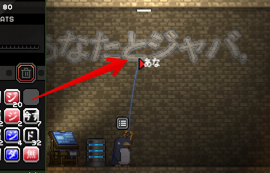

# Javabound

`Javabound` is a [Starbound] MOD that supplies several Javabutton-related artifact blueprints into your crafting interface. This MOD requires Starbound game as a base product. The game is available on [Steam].
All artifacts contributed by this mod can be crafted for free (as in Free Java Download). "Free as in Free Java Download" is our motto.

 &nbsp; &nbsp; 

## Detailed Description of Contents

This MOD includes:

* Category: Decorative
  * あなたとジャバ as **Sign of Java 1 (ja)**

    The first line of the message that accompanies the Javabutton.
    This artifact behaves like a mural painting.

  * 今すぐダウンロー, ド as **Sign of Java 2, 3 (ja)**

    The second and tertiary lines of runes that accompany the Javabutton.
    These artifacts behave like mural paintings.

  * Red Java Button as **Crimson Javabutton (ja)**

    The Javabutton is deepest red, as it is dyed with blood of the martyred.
    You can play with this artifact like a `percussion instrument`.

  * Blue Java Button as **Navy Javabutton (ja)**

    This archaic button is a sacred embodiment of unrecompensated download.
    You can play with this artifact like a `percussion instrument`.

  * Red Java Block as **Crimson Block (ja)**

    A tiny block reminiscent of the Javabutton, blessed with mythical rune.
    This artifact behaves like a table.

* Category: Furniture

  * Red Java Couch as **Crimson Javacouch (ja)**

    The Javacouch is deepest red, as it is dyed with blood of the martyred.
    You can play with this artifact like a `wall mounted couch`.

  * Blue Java Couch as **Navy Javacouch (ja)**

    This archaic couch is a sacred embodiment of unrecompensated download.
    Please handle it like a `wall mounted bed`.

* TODO: Runes that represent the soul of Java are currently in Japanese language. English version is under preparation. We appreciate your continued support for our product!

## Installation

1. Buy [Starbound at Steam]
1. Go to `Javabound` page at Steam Workshop
1. Hit the **Subscribe** button
1. You're all set!

Those who prefer manual installation can rename the src/ directory to Starbound/mods/javabound/. Beware; our support team may not be able to resolve problems caused by manual installation.

## Usage

1. Run Starbound, start a game with your favorite profile.
1. You need an `Inventor's Table`. If you haven't crafted one yet, hit C key to open the Crafting interface, then craft an `Inventor's Table` before putting it in a convenient place.
1. Use the `Inventor's Table` to craft a `Java Factory`. It should look like headquarters of some database company.

    

1. Use the `Java Factory` with pressing the E key on it.
   
   

1. Choose Java artifact of your choice. Click the Craft button to get your Java artifact instances for free (as in Free Java Download).

    

1. Place your artifact to wherever you like.

    

1. Have fun!!!

## License

Public Domain (Not unlike Java).

[Starbound]: http://playstarbound.com/ "Starbound"
[Crafting Station]: http://starbounder.org/Crafting_Station "Crafting Station - Starbounder - Starbound Wiki"
[Steam]: http://store.steampowered.com/ "Steam"
[Starbound at Steam]: http://store.steampowered.com/app/211820 "Starbound"
